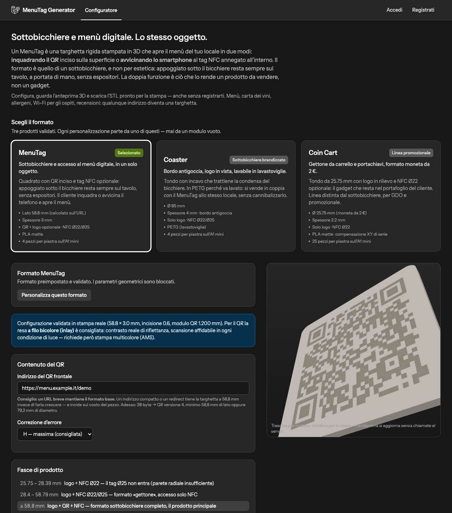
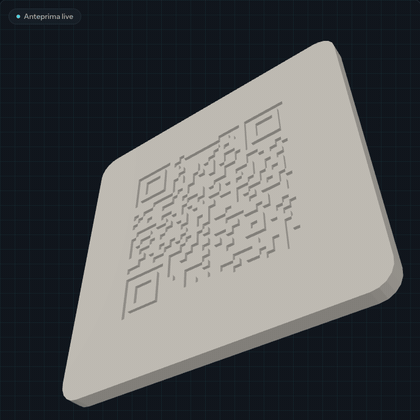
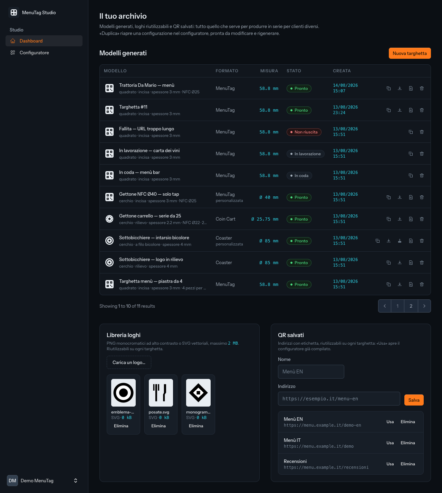
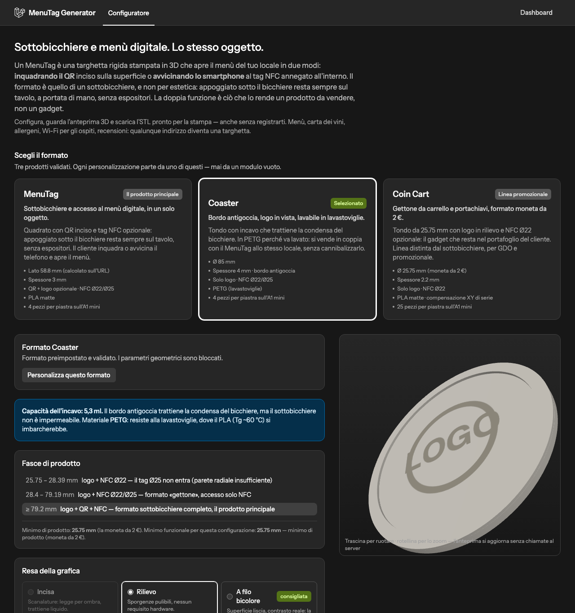
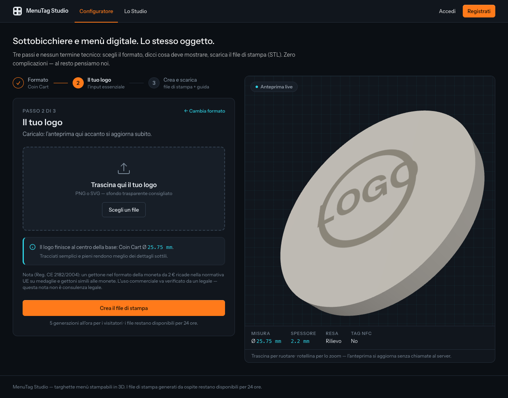
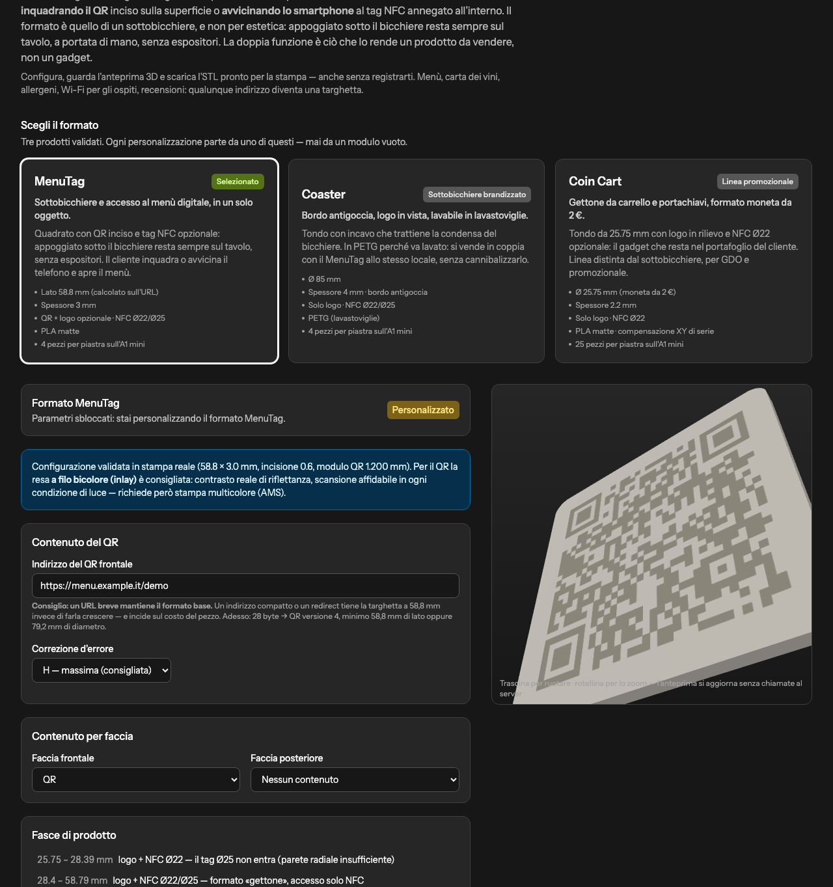
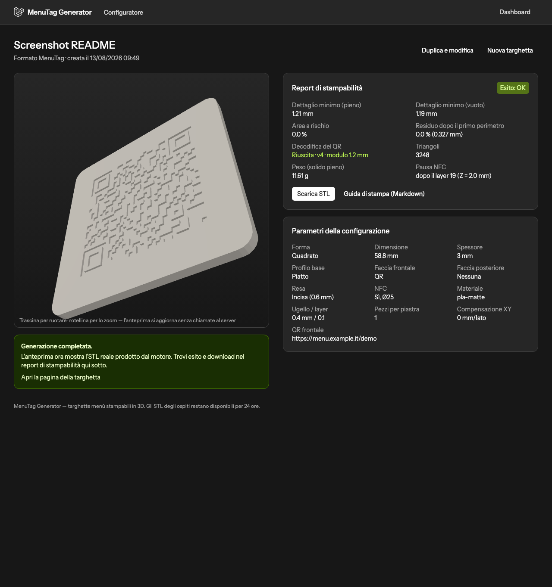

# MenuTag Generator

> **English summary** — MenuTag Generator is a Laravel 13 + Livewire 4 web app
> that lets restaurants and resellers configure and download 3D-printable
> "menu tags": rigid coaster-shaped table tags that open the venue's digital
> menu via an engraved QR code and/or an embedded NFC tag. Geometry is
> produced by a dedicated Python engine (`engine/menutag.py`) that exports
> watertight binary STL files validated for the Bambu Lab A1 mini, together
> with a generated print guide. Everything user-facing is in Italian — the
> product targets the Italian HORECA market — while code, comments and this
> repository's engineering artifacts are in English. Quick start: see
> [Avvio con Sail](#6-avvio-con-sail-in-due-comandi).

Configuratore web di **targhette menù stampabili in 3D**: l'oggetto ha il
formato di un sottobicchiere, sta sul tavolo sotto il bicchiere e dà accesso
al menù digitale del locale **avvicinando lo smartphone** (tag NFC annegato
nel pezzo) oppure **inquadrando il QR code** sulla superficie.

---

## Indice

1. [Cos'è un MenuTag e a chi si rivolge](#1-cosè-un-menutag-e-a-chi-si-rivolge)
2. [Architettura: Laravel orchestra, Python calcola](#2-architettura-laravel-orchestra-python-calcola)
3. [Perché MariaDB e non MySQL](#3-perché-mariadb-e-non-mysql)
4. [I tre formati e le fasce di prodotto](#4-i-tre-formati-e-le-fasce-di-prodotto)
5. [Le tre rese della grafica](#5-le-tre-rese-della-grafica)
6. [Avvio con Sail in due comandi](#6-avvio-con-sail-in-due-comandi)
7. [Setup senza Docker](#7-setup-senza-docker)
8. [Il motore da riga di comando](#8-il-motore-da-riga-di-comando)
9. [Stampa su Bambu Lab A1 mini](#9-stampa-su-bambu-lab-a1-mini)
10. [Avvertenza normativa sul Coin Cart](#10-avvertenza-normativa-sul-coin-cart)
11. [API REST](#11-api-rest)
12. [Roadmap onesta](#12-roadmap-onesta)
- [Deviazioni e scelte dichiarate](#deviazioni-e-scelte-dichiarate)

---

## 1. Cos'è un MenuTag e a chi si rivolge

Un **MenuTag** è una targhetta rigida da tavolo, stampata in 3D, che apre il
menù digitale in due modi: **tap NFC** (tag annegato dentro il pezzo, chiuso
in stampa con una pausa a metà lavoro) e **QR code** inciso o intarsiato
sulla superficie. Il formato da sottobicchiere non è un vezzo estetico: sotto
il bicchiere la targhetta **resta sempre presente e a portata di mano**,
senza occupare spazio né richiedere espositori. È insieme un sottobicchiere e
il punto d'accesso al menù — **la doppia funzione è l'argomento di vendita**.

Lo stesso oggetto veicola anche carta dei vini, lista allergeni, credenziali
Wi-Fi, pagina recensioni, ordinazione al tavolo, raccolta punti.



L'anteprima parametrica **non genera richieste al server**: three.js
ricalcola la geometria e il QR (libreria `qrcode`, stessa tabella di
capacità byte-mode di PHP e motore) client-side a ogni trascinamento.



**A chi si rivolge:**

- **Cliente diretto (B2B):** ristoranti, bar, caffetterie, pizzerie,
  birrerie, gelaterie, hotel, B&B, agriturismi. Tipicamente non possiedono
  una stampante 3D: scaricano l'STL e lo portano a un service di stampa —
  per questo ogni download è accompagnato da una **guida di stampa
  generata** comprensibile a chi non ha seguito la configurazione.
- **Cliente rivenditore (il segmento a maggior volume):** agenzie web,
  tipografie, service di stampa 3D, fornitori HORECA. Generano targhette
  **per conto dei propri clienti**, in serie e con loghi diversi: da qui la
  dashboard con libreria loghi, QR salvati, storico e duplicazione delle
  configurazioni.



## 2. Architettura: Laravel orchestra, Python calcola

```
Browser ── Livewire 4 (configuratore + anteprima three.js client-side)
   │
Laravel 13 ── validazione (Form Request + DTO, invarianti V1–V12)
   │          record MenuTag (queued) ── coda database
   │                                        │
   │                              worker: GenerateMenuTagJob
   │                                        │  Process (argv array)
   │                              engine/menutag.py (Python 3.12, venv)
   │                                        │
   │          report CHIAVE=VALORE ◄── STL binario watertight
   ▼
download STL + guida di stampa generata
```

La scelta ibrida è deliberata: **le librerie per geometria 2D robusta,
tracciamento di bitmap, generazione QR con versione/EC/maschera forzabili e
mesh watertight esistono in Python e non hanno equivalenti PHP** (shapely,
segno, manifold3d, trimesh, OpenCV, svgelements — motivazioni riga per riga
in `engine/README.md`). Riscrivere anche solo la parte 2D in PHP
significherebbe mantenere due implementazioni di geometria computazionale.
Laravel fa ciò in cui eccelle: HTTP, validazione, code, autorizzazione,
persistenza; Python produce la geometria e riferisce l'esito su stdout in
righe `CHIAVE=VALORE`.

Punti fissi dell'integrazione:

- l'**unica** classe che tocca `Process` è `App\Services\PythonMenuTagEngine`;
  gli argomenti sono **sempre un array** costruito da
  `MenuTagParameters::toCliArguments()` — mai stringhe concatenate;
- la generazione è **asincrona** (coda `database`): il job ha timeout 120 s,
  maggiore dei 60 s del processo, così l'errore viene sempre registrato sul
  record (spec §7.4); un comando schedulato recupera i record appesi;
- exit code partizionati: `0` successo (anche con avvisi), `2` errore
  **dell'utente** con messaggio in italiano mostrato così com'è, qualunque
  altro valore errore **interno**, loggato e mai esposto;
- i test **non invocano mai Python**: il contratto `MenuTagEngineContract` è
  bindato in ambiente `testing` a un `FakeMenuTagEngine` che simula i tre
  esiti; esiste **un solo** test d'integrazione, marcato
  `->group('integration')`, che salta se `engine/.venv` non esiste.

## 3. Perché MariaDB e non MySQL

Due ragioni, entrambe di sostanza:

1. **Licenza e governance.** MariaDB è **interamente GPL**, sviluppato da una
   fondazione indipendente con roadmap pubblica; MySQL è controllato da
   Oracle, con un modello dual-license e feature riservate alle edizioni
   commerciali. Per un progetto che vive su GitHub e deve restare avviabile
   da chiunque, la catena di dipendenze pienamente libera è un requisito, non
   una preferenza.
2. **Driver dedicato.** Laravel (dall'11 in poi) ha un **driver `mariadb`
   nativo**: `DB_CONNECTION=mariadb` in `.env`. Non è il driver MySQL
   riusato: dichiara le capacità reali del server (es. gestione dei tipi e
   delle sequenze specifica di MariaDB) invece di trattarlo come un MySQL
   qualunque.

Il servizio Docker è `mariadb:11` con volume persistente (`sail-mariadb`).
In locale senza Docker il progetto funziona anche su sqlite (vedi §7); la
suite di test gira su sqlite in-memory.

## 4. I tre formati e le fasce di prodotto

Il catalogo è composto da **tre prodotti preimpostati e validati**. Il
generatore parametrico **non è una quarta opzione**: è la modalità
«personalizza questo formato» di ciascun preset — si parte sempre da una base
verificata, mai da un form vuoto.

| | **MenuTag** *(default)* | **Coaster** | **Coin Cart** |
|---|---|---|---|
| Funzione | accesso al menù digitale | sottobicchiere antigoccia brandizzato | gettone da carrello / portachiavi |
| Forma | quadrato, angoli r4 | tondo | tondo |
| Dimensione | **58.8 mm** (pavimento dinamico, vedi sotto) | **Ø 85 mm** | 25.75 mm (moneta da 2 €) |
| Spessore | 3.0 mm | 4.0 mm | 2.20 mm |
| Profilo base | piatto | **bordo antigoccia** (bordo 5, incavo 1.2) | piatto |
| Contenuto | **QR** (+ logo opzionale) | **solo logo** | solo logo |
| Resa consigliata | `inlay` bicolore (`engrave` in ripiego) | `inlay` o `relief` — **mai `engrave`** | `relief` |
| NFC | opzionale, Ø22/Ø25 | opzionale, Ø22/Ø25 | opzionale, **solo Ø22** |
| Materiale | PLA matte | **PETG** | PLA matte |
| Capacità liquido | — | **5.3 ml** (calcolata e mostrata) | — |
| Compensazione XY | 0 | 0 | **−0.10 mm/lato** (vedi §10) |
| Pezzi per piatto A1 mini | 4 | 4 | 25 |

<table>
<tr>
<td width="50%">



</td>
<td width="50%">



</td>
</tr>
</table>

**Le fasce di prodotto** (chi può avere cosa, a quale dimensione):

| Fascia | Disponibile | Perché |
|---|---|---|
| 25.75 – 28.39 mm | logo + **NFC Ø22** | il tag Ø25 lascerebbe 0.175 mm di parete radiale |
| 28.40 – 58.79 mm | logo + **NFC Ø22/Ø25** | formato "gettone": accesso solo NFC |
| ≥ 58.80 mm (quadrato) · ≥ 79.20 mm (cerchio) | logo + **QR** + NFC | il sottobicchiere completo — il prodotto principale |

**Perché il QR richiede 58.8 mm di lato (79.2 di diametro).** Un QR
versione 6 ha 41 moduli; con la quiet zone servono 49 moduli di spazio. Alla
soglia di resa piena — passo del modulo ≥ 3 × l'ugello da 0.4 mm, cioè
**1.200 mm** — servono 58.8 mm di lato. In un **cerchio** il simbolo va
inscritto sulla diagonale: `41 × √2 + 8` moduli → **79.2 mm** di diametro. A
parità di ingombro il quadrato dà un modulo **~35 % più grande**: per questo
è la forma di default. Sotto soglia le opzioni QR sono **disabilitate con la
spiegazione** e la dimensione minima calcolata sull'URL inserito; i pavimenti
restano validi anche con ugello 0.2 (scelta di prodotto: scansionabilità
garantita, `product.qr.min_pitch_mm`).

**Il lato del MenuTag è un pavimento, non una costante.** URL più lunghi
richiedono versioni QR superiori: il preset ricalcola
`max(58.8, size_min_qr(URL))` e adegua verso l'alto **con avviso esplicito**,
mai in silenzio e mai riducendo una dimensione impostata a mano. Un URL da
64 byte sta nella versione 7 (63.6 mm di lato); a 65 byte serve la versione 8
(68.4 mm) — la tabella ISO byte-mode in `config/product.php` è l'unica fonte
per PHP, JavaScript e Python, coperta da test di parità sui casi al confine.
Nella UI, dove si scrive l'URL, c'è il consiglio che incide sul costo del
pezzo: **un indirizzo breve (o un redirect) mantiene il formato base**.

**Perché il Coaster è Ø85 e non Ø90/Ø95.** Sul piano 180×180 dell'A1 mini due
pezzi da Ø85 con 5 mm di gioco stanno in 175 mm; due da Ø90 ne chiedono 185.
La soglia è a 87.5 mm: passare da Ø95 a Ø85 costa 1.5 ml di capacità e
**quadruplica i pezzi per piatto** (da 1 a 4). Per un cliente che ne ordina
cinquanta è la differenza fra cinquanta stampe e tredici.

**Perché il Coaster è in PETG.** Raccoglie condensa, quindi verrà lavato —
anche in lavastoviglie (60–70 °C). La transizione vetrosa del PLA è ~60 °C:
si imbarca. Il PETG (~80 °C) no. Il materiale è **per preset**, non globale,
e alimenta soglie e guida di stampa.

## 5. Le tre rese della grafica

| Modalità | Superficie | Hardware | Note |
|---|---|---|---|
| `engrave` (inciso) | scanalature | qualunque | **trattiene liquido**: rifiutato sul Coaster (igiene, non estetica) |
| `relief` (rilievo) | sporgenze | qualunque | pulibile; sul profilo con bordo l'altezza deve restare **sotto il bordo** |
| `inlay` (a filo bicolore) | **liscia** | **multicolore** (AMS o cambio manuale) | resa migliore, superficie igienica |

**Perché l'intarsio rende il QR più affidabile.** Un QR inciso viene letto
per **ombra**: la scansione dipende dall'illuminazione, e sotto luce diffusa
può fallire. Un QR a filo bicolore ha **contrasto di riflettanza reale**,
come un QR stampato su carta: scuro e chiaro riflettono diversamente la luce
in qualunque condizione. La soglia dimensionale non cambia (dipende dalla
larghezza di estrusione, non dal contrasto), ma l'affidabilità in campo sì —
per questo la UI presenta `inlay` come opzione consigliata per il QR,
**dichiarando il requisito multicolore** e proponendo `relief` (o il
riempimento a vernice acrilica dell'incisione) come ripiego senza AMS.

In `inlay` il motore produce **due STL complanari** (corpo + accento); la
somma dei volumi deve coincidere col solido pieno entro 10⁻³ mm³ — è il
controllo che verifica l'accoppiamento. Le soglie di dettaglio salgono a
**4 × ugello** (serve la parete della base *e* il riempimento dell'accento) e
la profondità consigliata scende a 0.5 mm: ogni layer nella zona di intarsio
è bicromatico e costa uno spurgo.



## 6. Avvio con Sail in due comandi

Prerequisiti una tantum (Docker in esecuzione; servono le dipendenze PHP
perché l'immagine estende il runtime Sail contenuto in `vendor/`):

```bash
composer install
cp .env.example .env && php artisan key:generate
```

> Senza PHP sul host: `docker run --rm -v "$(pwd):/var/www/html" -w /var/www/html \
> laravelsail/php84-composer:latest composer install --ignore-platform-reqs`
> (l'immagine composer di Sail più recente è ferma a PHP 8.4:
> `--ignore-platform-reqs` scavalca il requisito `^8.5` del progetto — i
> container veri girano comunque su PHP 8.5, vedi Dockerfile)

Poi i **due comandi**:

```bash
./vendor/bin/sail up -d --build       # app + mariadb + worker + scheduler
./vendor/bin/sail artisan migrate:fresh --seed
```

Su un database **vuoto**, `worker` e `scheduler` partono insieme agli altri
servizi e possono interrogare tabelle che non esistono ancora: `supervisord`
(config in `docker/supervisord.conf`, `startretries=50` invece del default 3)
li fa crash-riprovare finché `migrate:fresh` non crea lo schema, senza alcun
intervento manuale — verificato con un avvio a freddo completo.

Per l'interfaccia servono anche gli asset frontend
(`./vendor/bin/sail npm install && ./vendor/bin/sail npm run build`), poi
l'app è su <http://localhost>.

**Utente demo** (solo locale, creato dal seeder):

| Campo | Valore |
|---|---|
| Email | `demo@menutag.test` |
| Password | `password` |

Il seeder popola libreria loghi (SVG **generati via codice**, mai file di
clienti reali), QR salvati e uno storico di targhette in tutti gli stati e
nelle tre fasce dimensionali, con report realistici: la dashboard, il report
di stampabilità e la guida di stampa si esplorano senza generare nulla.

Il `docker-compose.yml` definisce: `laravel.test` (l'app — il nome è il
default di Sail, così ogni comando `sail ...` funziona senza configurare
`APP_SERVICE`), `worker` (`queue:work`, **stesso bind mount di progetto
dell'app**: senza storage condiviso il worker non vede i loghi caricati e la
generazione muore con "file non trovato", spec §7.1), `scheduler`
(retention ospiti e recupero record appesi) e `mariadb` (volume persistente).
Il Dockerfile estende il runtime PHP di Sail installando `python3-venv` e le
librerie di sistema del motore, e **crea il virtualenv in build** in
`/opt/menutag-engine/venv` — fuori da `/var/www/html`, che è coperto dal
bind mount (il venv creato sul host macOS/Windows non funzionerebbe comunque
dentro Linux).

## 7. Setup senza Docker

Requisiti: PHP ≥ 8.5 con sqlite, Composer, Node 20+, Python 3.12.

```bash
composer install
cp .env.example .env && php artisan key:generate
# .env: DB_CONNECTION=sqlite e DB_DATABASE=/percorso/assoluto/database/database.sqlite
#       (crea il file con: touch database/database.sqlite)
#       MENUTAG_ENGINE_PYTHON può restare commentato: il default è engine/.venv
#       DB_QUEUE_RETRY_AFTER=150 è già nel .env.example: deve restare maggiore
#       del timeout del job (120 s), o la coda database riconsegna job vivi
php artisan migrate:fresh --seed

python3.12 -m venv engine/.venv
engine/.venv/bin/pip install -r engine/requirements.txt

npm install && npm run build
php artisan serve          # app
php artisan queue:work     # in un secondo terminale (generazioni asincrone)
php artisan schedule:work  # in un terzo (retention ospiti + recupero appesi)
```

Test (non richiedono Python: il motore è un fake; l'unico test d'integrazione
salta se `engine/.venv` manca):

```bash
php artisan test
```

## 8. Il motore da riga di comando

Il motore è utilizzabile anche da solo — contratto CLI completo in
`docs/contracts/03-motore-cli.md`, architettura e scelte di libreria in
`engine/README.md`.

```bash
# Il MenuTag di riferimento (58.8 × 3.0, QR inciso 0.6, NFC Ø25):
engine/.venv/bin/python3 engine/menutag.py \
  --shape square --size 58.8 --fillet 4.0 --thickness 3.0 \
  --front qr --mode engrave --depth 0.6 \
  --qr-data-front https://menu.example.it/demo --qr-ec H \
  --nfc --tag 25 --layer-height 0.1 \
  --out /tmp/menutag.stl

# Coaster Ø85 con logo a intarsio bicolore (due STL complanari):
engine/.venv/bin/python3 engine/menutag.py \
  --shape circle --size 85 --thickness 4 \
  --base-profile rimmed --rim-width 5 --recess-depth 1.2 \
  --front logo --logo /percorso/logo.svg --mode inlay --depth 0.5 \
  --material petg \
  --out /tmp/coaster.stl --out-accent /tmp/coaster-accento.stl

# Piastra da 25 gettoni con compensazione XY negativa (estensioni dichiarate):
engine/.venv/bin/python3 engine/menutag.py \
  --shape circle --size 25.75 --thickness 2.2 \
  --front logo --logo /percorso/logo.svg --mode relief --depth 0.4 \
  --plate 25 --xy-comp -0.10 \
  --out /tmp/coincart-piastra.stl
```

Su stdout escono righe `CHIAVE=VALORE` (`TRIANGLES`, `VOLUME_MM3`,
`WEIGHT_G`, `PAUSE_Z`/`PAUSE_LAYER` con `--nfc`, metriche QR e di
stampabilità, `WARNING=` ripetibile, `PRINTABILITY=ok|warn|blocked`); exit
`2` = errore d'uso con messaggio in italiano su stderr, altri exit ≠ 0 =
errore interno.

## 9. Stampa su Bambu Lab A1 mini

Profilo macchina in `config/printers.php` (piano 180×180×180, piatto PEI
testurizzato). Ogni targhetta completata ha la sua **guida di stampa
generata** (`/targhette/{id}/guida`, anche via API) coi valori reali del
pezzo; questi sono i riferimenti generali con **PLA matte**:



| | Ugello 0.2 | Ugello 0.4 |
|---|---|---|
| Layer height | 0.05 – 0.15 mm (default 0.10) | 0.08 – 0.30 mm (default 0.10) |
| **Primo layer** | **0.15 mm** | **0.20 mm** |
| Temperatura ugello / piatto | 220 / 65 °C | 220 / 65 °C |
| Ventola | 100 % | 100 % |
| Pareti / gusci / infill | 2 / 4 / 15 % | 2 / 4 / 15 % |
| Brim / supporti | sì / **no** | sì / **no** |

Il primo layer da 0.20 mm **non è stampabile con l'ugello 0.2**: la griglia
dei layer cambia base, e tutte le quote critiche (fondo incisioni, tasca NFC,
cima del pezzo) vengono riallineate dal motore al reticolo
`(z − primo_layer) / layer_height ∈ ℤ`. Mai attivare "only one wall": il
residuo dopo il primo perimetro è una delle metriche verificate.

**Procedura pausa NFC** (i valori esatti sono nel report e nella guida del
pezzo — il riferimento validato in stampa reale è 58.8 × 3.0 con pausa
`PAUSE_Z=2.0` **dopo il layer 19 di 29**):

1. nello slicer imposta la **pausa alla quota `PAUSE_Z`** indicata dal
   report, verificando che corrisponda al **layer `PAUSE_LAYER`**;
2. **misura col calibro lo spessore reale del tag** (adesivo incluso): se
   supera il valore dichiarato in configurazione, l'ugello lo colpisce alla
   ripresa e la stampa è persa — rigenera il pezzo con lo spessore misurato;
3. alla pausa appoggia il tag nella tasca (Ø22/Ø25 con 0.20 mm di gioco
   radiale) e riprendi la stampa;
4. il layer di chiusura attraversa 0.20 mm d'aria sopra il tag (vedi la
   [scelta sul gioco assiale](#deviazioni-e-scelte-dichiarate)): un aspetto
   irregolare di quel layer interno è previsto e invisibile.

## 10. Avvertenza normativa sul Coin Cart

Un gettone con le dimensioni della moneta da 2 € ricade nel campo di
applicazione del **Regolamento (CE) n. 2182/2004** su medaglie e gettoni
simili alle monete in euro, che vincola bande dimensionali e elementi di
design. I gettoni da carrello legittimi esistono e sono diffusi, ma **prima
di un uso commerciale il progetto grafico va verificato con un legale**:
questa applicazione mostra l'avvertenza nel preset e qui nel README, e
**non costituisce consulenza legale**. L'avviso è visibile anche nella UI del
preset Coin Cart.

Nota tecnica collegata: il preset applica una **compensazione XY di
−0.10 mm per lato** perché una stampa FDM di 25.75 mm nominali esce a
25.85–25.95 mm (sovrapposizione degli estrusi) e **si incepperebbe nella
fessura del carrello**. La guida di stampa impone la misura col calibro sul
primo pezzo: il valore esatto dipende dalla calibrazione della macchina.

## 11. API REST

API versionata `/api/v1` a token **Sanctum** (il flusso ospite esiste solo
sul web). Contratto completo: [`docs/openapi.yaml`](docs/openapi.yaml).
La generazione è asincrona: `POST` risponde **202** e si interroga lo stato.
Rate limit: 30 generazioni/ora per utente (`429` oltre soglia).

```bash
TOKEN="il-tuo-token-sanctum"

# Accoda una generazione (202 + record queued)
curl -s -X POST http://localhost/api/v1/menu-tags \
  -H "Authorization: Bearer $TOKEN" \
  -H "Content-Type: application/json" -H "Accept: application/json" \
  -d '{
    "preset": "menutag",
    "label": "Trattoria da Mario",
    "parameters": {
      "shape": "square", "size": 58.8, "fillet": 4.0, "thickness": 3.0,
      "front": "qr", "mode": "engrave", "depth": 0.6,
      "qr_data_front": "https://menu.example.it/demo",
      "nfc": true, "tag_diameter": 25
    }
  }'

# Stato e report (403 se il record è di un altro utente, 404 se non esiste)
curl -s http://localhost/api/v1/menu-tags/1 \
  -H "Authorization: Bearer $TOKEN" -H "Accept: application/json"

# Elenco paginato con filtri
curl -s "http://localhost/api/v1/menu-tags?filter[status]=completed&per_page=10" \
  -H "Authorization: Bearer $TOKEN" -H "Accept: application/json"

# STL (409 finché lo stato non è completed; ?part=accent per l'intarsio)
curl -sOJ "http://localhost/api/v1/menu-tags/1/download" \
  -H "Authorization: Bearer $TOKEN"

# Guida di stampa in Markdown (text/markdown)
curl -s "http://localhost/api/v1/menu-tags/1/guide" \
  -H "Authorization: Bearer $TOKEN"

# Upload di un logo nella libreria (PNG/SVG, max 2 MB, MIME dal contenuto)
curl -s -X POST http://localhost/api/v1/logos \
  -H "Authorization: Bearer $TOKEN" -H "Accept: application/json" \
  -F "file=@logo.svg"
```

Il token si crea dalla dashboard oppure via tinker:
`$user->createToken('cli')->plainTextToken`.

**Nota sugli URL firmati degli ospiti (web).** Il download ospite usa
`URL::temporarySignedRoute()` con scadenza allineata alla retention di 24 h:
è un accesso **capability-based** — la firma garantisce che l'URL sia stato
prodotto dall'applicazione e non manomesso né scaduto, **non l'identità di
chi lo apre**. Chiunque abbia il link può scaricare quell'STL finché non
scade. È un compromesso dichiarato, accettabile per l'STL di un ospite; gli
utenti autenticati passano **sempre** dalle Policy, mai da URL firmati
(spec §7.2, docblock di `EnsureGuestToken`).

## 12. Roadmap onesta

Dichiarato e **non implementato** (decisioni Fase 0 §6, spec §2.5/§8.9):

- composizione **logo + QR + testo sulla stessa faccia**;
- etichette incise nel margine (`--label-front` / `--label-back`, es. sigle
  lingua IT/EN sul bifacciale);
- export **3MF** con profilo di stampa incorporato;
- profili per stampanti oltre la A1 mini (`config/printers.php` è già
  strutturato per riceverli).

Limiti e code note dei workstream, da rifinire:

- **Verifica end-to-end nel browser** del canvas WebGL (rotazione, texture
  QR, caricamento STL reale): il cablaggio è verificato via markup e suite
  Pest; un test Dusk/browser resta da aggiungere.
- **Anteprima loghi come data URI**: con PNG vicini ai 2 MB il payload
  Livewire è pesante; l'evoluzione naturale è una rotta di anteprima protetta
  da `LogoAssetPolicy::view`.
- **Messaggi di validazione del framework** non coperti dalle mappe custom
  (casi limite fuori dai campi mappati) uscirebbero in inglese: valutare
  `lang/it` completo.
- **Rate limit API 30/h per utente** è un'assunzione dichiarata di Fase 0, da
  confermare col cliente.
- Un logo ospite viene **eliminato a ogni esito terminale del job**, incluso
  l'errore utente: l'ospite che corregge i parametri ricarica il logo (scelta
  documentata nel job; per riusarlo basterebbe restringere la cancellazione
  all'esito `completed`).
- `welcome.blade.php` dello starter kit non è più raggiungibile (la home è il
  configuratore): rimozione cosmetica rimandata.
- **`sail up` verificato end-to-end** (build immagine, 4 servizi, generazione
  reale via worker con motore Python, volume storage condiviso, API HTTP):
  esito conforme al riferimento validato (`PAUSE_Z=2.0`, `PAUSE_LAYER=19`,
  `PRINTABILITY=ok`). La prima verifica aveva scoperto una corsa d'avvio su
  database vuoto (`worker`/`scheduler` partono insieme a
  `mariadb`/`laravel.test` e possono interrogare tabelle inesistenti prima di
  `migrate:fresh`, esaurendo i retry rapidi di `supervisord` e restando
  `FATAL` per sempre): risolta alla radice in `docker/supervisord.conf`
  (`startretries=50`), **non serve più alcun intervento manuale** — riverificato
  con un avvio a freddo completo (`down -v` → `up -d` → `migrate:fresh --seed`
  → generazione reale, senza toccare i container).

## Deviazioni e scelte dichiarate

Tutte già fissate in `docs/contracts/00-decisioni-fase0.md`; le principali:

- **Livewire 4 + starter kit ufficiale (Fortify) al posto di Breeze +
  Livewire 3.** Il prompt chiede insieme «ultima major stabile» e «Breeze»,
  ma Breeze non esiste più per Laravel 13: la strada documentata è lo starter
  kit ufficiale Livewire, che monta Livewire 4. Tutti i vincoli tecnici
  (`wire:ignore`, `@entangle`, `wire:key`, `wire:poll` condizionale,
  `$wire.on`, dispose nel `destroy()` di Alpine) esistono invariati.
- **`WEIGHT_PLA_G` → `WEIGHT_G`** (e colonna `weight_g`): col PETG in
  catalogo il peso è calcolato con la densità del materiale scelto (PLA 1.24,
  PETG 1.27 g/cm³); un nome che promette PLA mentirebbe sul Coaster. È il
  peso del **solido pieno**: limite superiore rispetto alla stampa con
  infill, annotato nella guida.
- **Estensioni CLI dichiarate**: `--plate N` (piastra da N pezzi, passo
  bbox + 5 mm, griglia quasi quadrata centrata) e `--xy-comp` (mm per lato,
  sola silhouette esterna). Le validazioni NFC usano la dimensione
  **effettiva** `size + 2×xy_comp`; minimi di prodotto e pavimenti QR usano
  la **nominale** (quote di progetto).
- **Gioco assiale della tasca NFC = 0.20 mm** (spec §3.3, adottata e
  ribadita qui come richiesto): la tasca è 0.20 mm più profonda del tag,
  quindi il tag **non** fa da pavimento al primo layer di chiusura, che
  attraversa 0.20 mm d'aria. Il costo è un layer interno irregolare e
  invisibile; il costo della scelta opposta — l'ugello che sbatte su un tag
  più spesso del dichiarato — è la stampa persa. Lo spessore minimo con NFC
  è **calcolato** (`tag + gioco + 2×pareti + incisioni [+ incavo]`), mai una
  costante: con due facce incise a 0.6 il minimo è 3.00 mm, quindi il minimo
  di prodotto 2.20 è incompatibile con la tasca — vincolo derivato, mostrato
  all'utente, non nascosto.
- **Argv `--tag-thickness`**: l'esempio del contratto 02 mostra `0.80`, la
  regola di emissione deterministica produce `0.8` (un float PHP non
  distingue le due scritture; identiche per argparse). I test di mapping
  seguono la regola documentata.
- **Pest aggiunto come dipendenza dev** da WS-6: lo stack del prompt lo
  richiede ma lo starter kit installa solo PHPUnit; la suite (Pest v4 +
  plugin Laravel) convive coi test PHPUnit dello scaffold.
